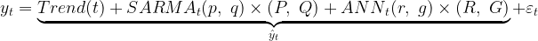

# SARIMANNX
**SARIMANNX**, Seasonal AutoRegressive Integrated
Moving Average Neural Network with eXogenous regressors,
a time series forecasting model.

SARIMANNX is a simple generalization of SARIMAX for
capturing a nonlinearities in time series, so
SARIMANNX is more appropriate to forecast a nonlinear or
sum of linear and nonlinear time series.

## Installation

### Requirements:
* Python >= (3.8)
* NumPy >= (1.20.3)
* SciPy >= (1.6.3)

### Installation:
1. Clone this repo;
2. Copy "sarimannx" folder in your project.


## Basic concepts
Let ![y_t] be a researched time series observation at
time t. If time series is nonstationary, there is one way 
to make it stationary -- computing the differences between 
consecutive observations, i.e. **differencing:** 
![y'_t = y_t - y_{t-1}] and **seasonal differencing:** 
![y'_t = y_t - y_{t-s}].

Suppose, that after d-times differencing and D-times 
seasonal differencing with season length s, we have a 
stationary time series ![y_t]. Then it can be represented as

<p align="center">
    
</p>

where

* ![\hat y_t] -- prediction at time t;

* ![x^{(0)}_t, \dots, x^{(h)}_t] -- exogenous regressors at 
  time t;

* ![\varepsilon_t = y_t - \hat y_t] -- white noise value at 
  time t, which often referred to as the innovation or shock 
  at time t;

* ![p,\ r] -- AutoRegression(AR) orders of ![{SARMA}] and ![{ANN}];

* ![q,\ g] -- MovingAverage(MA) orders of ![{SARMA}] and ![{ANN}];

* ![P = (P_0, \dots, P_k),\ R = (R_0, \dots, R_u)] -- set of 
  seasonal AR lags of ![{SARMA}] and ![{ANN}];

* ![Q = (Q_0, \dots, Q_l),\ G = (G_0, \dots, G_v)] -- set of 
  seasonal MA lags of ![{SARMA}] and ![{ANN}];

* ![{Trend}(t)] -- trend polynomial;

* ![{SARMA}_t(p,\ q)\times(P,\ Q) = \mathbf{W_{sarima}} \cdot 
  \mathbf{y^{(t-1)}_{sarima}}],

    * ![\mathbf{y^{(t-1)}_{sarima}} = (y_{t-1}, \dots, y_{t-p}, y_{t-P_0}, \dots, y_{t-P_k}, 
      \varepsilon_{t-1}, \dots, \varepsilon_{t-q}, \varepsilon_{t-Q_0}, \dots, \varepsilon_{t-Q_l},
      x^{(0)}_t, \dots, x^{(h)}_t)]
    
    * ![\mathbf{W_{sarima}}] -- weights vector;

* ![{ANN}_t(r,\ g)\times(R,\ G) = \mathbf{W^{(n)}_{ann}} \cdot 
    F(\dots F(\mathbf{W^{(1)}_{ann}} \cdot 
    F(\mathbf{W^{(0)}_{ann}} \cdot \mathbf{y^{(t-1)}_{ann}} + 
    \mathbf{b^{(0)}_{ann}}) + \mathbf{b^{(1)}_{ann}})\dots)]

    * ![\mathbf{y^{(t-1)}_{ann}} = (y_{t-1}, \dots, y_{t-r}, y_{t-R_0}, \dots, y_{t-R_u}, 
        \varepsilon_{t-1}, \dots, \varepsilon_{t-g}, \varepsilon_{t-G_0}, \dots, \varepsilon_{t-G_v},
        x^{(0)}_t, \dots, x^{(h)}_t)]
    
    * ![\mathbf{W^{(0)}_{ann}}, \dots, 
        \mathbf{W^{(n-1)}_{ann}}] -- weights matrices,
    
    * ![\mathbf{W^{(n)}_{ann}}] -- weights vector,
    
    * ![\mathbf{b^{(0)}_{ann}}, \dots, 
        \mathbf{b^{(n-1)}_{ann}}] -- bias vectors,
    
    * ![F(\cdot)] -- vector function;
    
This model is 
![SARIMANNX(p,\ q,\ d,\ r,\ g)\times(P,\ Q,\ D,\ R,\ G,\ s)].

**SARIMANNX** can be considered as a recurrent neural 
network (RNN) with skip connections that produce an output 
at each time step and have recurrent connections from 
the outputs at previous MAX_MA_LAG time steps to the 
input at the next time step, where part of input passes 
through Fully Connected Layers and part skips it, 
as illustrated in figure below:

(here 
![\mathbf{\varepsilon^{(t-1)}} = (\varepsilon_{t-1}, 
  \dots, \varepsilon_{t-MAX\_MA\_LAG})],
![\mathbf{y^{(t-1)}} = (y_{t-1}, \dots, y_{t-MAX\_AR\_LAG}, 
  x^{(0)}_{t-1}, \dots, x^{(h)}_{t-1})]
)


[y_t]: ./imgs/equations/eq01.png
[y'_t = y_t - y_{t-1}]: ./imgs/equations/eq02.png
[y'_t = y_t - y_{t-s}]: ./imgs/equations/eq03.png
[y_t = \underbrace{{Trend}(t) + {SARMA}_t(p,\ q)\times(P,\ Q) + 
 {ANN}_t(r,\ g)\times(R,\ G)}_{\hat y_t} + \varepsilon_t]: ./imgs/equations/eq04.png
[\hat y_t]: ./imgs/equations/eq05.png
[x^{(0)}_t, \dots, x^{(h)}_t]: ./imgs/equations/eq06.png
[\varepsilon_t = y_t - \hat y_t]: ./imgs/equations/eq07.png
[p,\ r]: ./imgs/equations/eq08.png
[{SARMA}]: ./imgs/equations/SARMA.png
[{ANN}]: ./imgs/equations/ANN.png
[q,\ g]: ./imgs/equations/eq09.png
[P = (P_0, \dots, P_k),\ R = (R_0, \dots, R_u)]: ./imgs/equations/eq10.png
[Q = (Q_0, \dots, Q_l),\ G = (G_0, \dots, G_v)]: ./imgs/equations/eq11.png
[{Trend}(t)]: ./imgs/equations/eq12.png
[{SARMA}_t(p,\ q)\times(P,\ Q) = \mathbf{W_{sarima}} \cdot \mathbf{y^{(t-1)}_{sarima}}]: ./imgs/equations/eq13.png
[\mathbf{y^{(t-1)}_{sarima}} = (y_{t-1}, \dots, y_{t-p}, y_{t-P_0}, \dots, y_{t-P_k}, 
 \varepsilon_{t-1}, \dots, \varepsilon_{t-q}, \varepsilon_{t-Q_0}, \dots, \varepsilon_{t-Q_l}, 
 x^{(0)}_t, \dots, x^{(h)}_t)]: ./imgs/equations/eq14.png
[\mathbf{W_{sarima}}]: ./imgs/equations/eq15.png
[{ANN}_t(r,\ g)\times(R,\ G) = \mathbf{W^{(n)}_{ann}} \cdot 
 F(\dots F(\mathbf{W^{(1)}_{ann}} \cdot 
 F(\mathbf{W^{(0)}_{ann}} \cdot \mathbf{y^{(t-1)}_{ann}} + 
 \mathbf{b^{(0)}_{ann}}) + \mathbf{b^{(1)}_{ann}})\dots)]: ./imgs/equations/eq16.png
[\mathbf{y^{(t-1)}_{ann}} = (y_{t-1}, \dots, y_{t-r}, y_{t-R_0}, \dots, y_{t-R_u}, 
 \varepsilon_{t-1}, \dots, \varepsilon_{t-g}, \varepsilon_{t-G_0}, \dots, \varepsilon_{t-G_v},
 x^{(0)}_t, \dots, x^{(h)}_t)]: ./imgs/equations/eq17.png
[\mathbf{W^{(0)}_{ann}}, \dots, \mathbf{W^{(n-1)}_{ann}}]: ./imgs/equations/eq18.png
[\mathbf{W^{(n)}_{ann}}]: ./imgs/equations/eq19.png
[\mathbf{b^{(0)}_{ann}}, \dots, \mathbf{b^{(n-1)}_{ann}}]: ./imgs/equations/eq20.png
[F(\cdot)]: ./imgs/equations/eq21.png
[SARIMANNX(p,\ q,\ d,\ r,\ g)\times(P,\ Q,\ D,\ R,\ G,\ s)]: ./imgs/equations/eq22.png
[\mathbf{\varepsilon^{(t-1)}} = (\varepsilon_{t-1}, 
 \dots, \varepsilon_{t-MAX\_MA\_LAG})]: ./imgs/equations/eq23.png
[\mathbf{y^{(t-1)}} = (y_{t-1}, \dots, y_{t-MAX\_AR\_LAG}, 
 x^{(0)}_{t-1}, \dots, x^{(h)}_{t-1})]: ./imgs/equations/eq24.png

## Implementation reference
<dl>
    <dt>
        <div style="font-weight: normal">class <code>sarimannx.sarimannx.SARIMANNX</code>(
            order=(1, 0, 0, 1, 0), seasonal_order=(0, 0, 0, 0, 0, 0),
            ann_hidden_layer_sizes=10, ann_activation="tanh", trend="n",
            optimize_init_shocks=True, grad_clip_value=1e+140, 
            max_grad_norm=10, logging_level=logging.WARNING, 
            solver="L-BFGS-B", **solver_kwargs)</div>
    </dt>
    <dd>
        <p>This model optimizes the squared-loss (MSE) using LBFGS or 
        other optimizers available in 
        <a href="https://docs.scipy.org/doc/scipy/reference/generated/scipy.optimize.minimize.html">
        scipy.optimize.minimize</a>.</p>
        <dl>
            <dt><span style="font-style: normal">Parameters</span></dt>
            <dd>
                <dl>
                    <dt>order : iterable, optional</dt>
                    <dd>The (p, q, d, r, g) order of the model. All values must be an 
                        integers.<br/>Default is (1, 0, 0, 1, 0).</dd>
                    <dt>seasonal_order : iterable, optional</dt>
                    <dd>The (P, Q, D, R, G, s) order of the seasonal component of the model.
                        D and s must be an integers, while P, Q, R and G may either be an 
                        integers or iterables of integers. s needed only for differencing, 
                        so all necessary seasonal lags must be specified explicitly.<br/>
                        Default is no seasonal effect.</dd>
                    <dt>ann_hidden_layer_sizes : iterable, optional</dt>
                    <dd>The ith element represents the number of neurons in the ith hidden 
                        layer in ANN part of the model. All values must be an integers.<br/>Default is (10,).</dd>
                    <dt>ann_activation : {"identity", "logistic", "tanh", "relu"}</dt>
                    <dd>
                        Activation function for the hidden layer in ANN part of the model.
                        <ul>
                            <li><p>"identity", no-op activation,<br/>returns f(x) = x</p></li>
                            <li><p>"logistic", the logistic sigmoid function,<br/>
                                   returns f(x) = 1 / (1 + exp(-x)).</p></li>
                            <li><p>"tanh", the hyperbolic tan function,<br/>
                                   returns f(x) = tanh(x).</p></li>
                            <li><p>"relu", the rectified linear unit function,<br/>
                                   returns f(x) = max(0, x)</p></li>
                        </ul>
                        Default is "tanh".
                    </dd>
                    <dt>trend : str{"n","c","t","ct"} or iterable, optional</dt>
                    <dd>Parameter controlling the deterministic trend polynomial Trend(t). 
                        Can be specified as a string where "c" indicates a constant 
                        (i.e. a degree zero component of the trend polynomial), 
                        "t" indicates a linear trend with time, and "ct" is both. Can also 
                        be specified as an iterable defining the powers of t included in polynomial. 
                        For example, [1, 2, 0, 8] denotes a*t + b*t^2 + c + d*t^8.<br/>
                        Default is to not include a trend component.</dd>
                    <dt>optimize_init_shocks : bool, optional</dt>
                    <dd>Whether to optimize first MAX_MA_LAG shocks as additional model parameters 
                        or assume them as zeros. If the sample size is relatively small, initial 
                        shocks optimization is more preferable.<br/>
                        Default is True.</dd>
                    <dt>grad_clip_value : int, optional</dt>
                    <dd>Maximum allowed value of the gradients. The gradients are clipped in 
                        the range [-grad_clip_value, grad_clip_value]. Gradient clipping by 
                        value used for intermediate gradients, where gradient clipping by 
                        norm is not applicable. Clipping needed for fixing gradint explosion.<br/>
                        Default is 1e+140.</dd>
                    <dt>max_grad_norm : int, optional</dt>
                    <dd>Maximum allowed norm of the final gradient. If the final gradient 
                        norm is greater, final gradient will be normalized and multiplied by 
                        max_grad_norm. Gradient clipping by norm used for final gradient to 
                        fix its explosion.<br/>
                        Default is 10.</dd>
                    <dt>logging_level : int, optional</dt>
                    <dd>If logging is needed, firstly necessary to initialize logging config 
                        and then choose appropriate logging level for logging training progress. 
                        Without config no messages will be displayed at either logging level
                        (Do not confuse with warning messages from warnings library which 
                        simply printing in stdout. For disable it use 
                        warnings.filterwarnings("ignore") for example). For more details 
                        see <a href="https://docs.python.org/3/howto/logging.html">logging HOWTO</a>.<br/>
                        Default is 30.</dd>
                    <dt>solver : str, optional</dt>
                    <dd>The solver for weights optimization. For a full list 
                        of available solvers, see 
                        <a href="https://docs.scipy.org/doc/scipy/reference/generated/scipy.optimize.minimize.html">
                        scipy.optimize.minimize</a>.<br/>
                        Default is "L-BFGS-B".</dd>
                    <dt>**solver_kwargs</dt>
                    <dd>Additional keyword agruments for the solver(For example, 
                        maximum number of iterations or optimization tolerance). 
                        For more details, see 
                        <a href="https://docs.scipy.org/doc/scipy/reference/generated/scipy.optimize.minimize.html">
                        scipy.optimize.minimize</a>.</dd>
                </dl>
            </dd>
            <dt><span style="font-style: normal">Attributes</span></dt>
            <dd>
                <dl>
                    <dt>loss_ : float</dt>
                    <dd>The final loss computed with the loss function.</dd>
                    <dt>n_iter_ : int</dt>
                    <dd>The number of iterations the solver has run.</dd>
                    <dt>trend_coefs : numpy ndarray</dt>
                    <dd>Trend polynomial coefficients.</dd>
                    <dt>sarima_coefs : numpy ndarray</dt>
                    <dd>Weights vector of SARIMA part of the model. First p coefficients 
                    corresponds to AR part, next len(P) corresponds to seasonal 
                    AR part, next q corresponds to MA part and last len(Q) 
                    coefficients corresponds to seasonal MA part. </dd>
                    <dt>ann_coefs : list of numpy ndarrays</dt>
                    <dd>Weights matrices of ANN part of the model. The ith element 
                    in the list represents the weight matrix corresponding to layer i.</dd>
                    <dt>ann_intercepts : list of numpy ndarrays</dt>
                    <dd>Bias vectors of ANN part of the model. The ith element 
                    in the list represents the bias vector corresponding to layer 
                    i + 1. Output layer has no bias.</dd>
                    <dt>init_shocks : numpy ndarray</dt>
                    <dd>The first MAX_MA_LAG shocks. If optimize_init_shocks is 
                    False, then after training they will be zeros, else initial 
                    shocks will be optimized as other model weights.</dd>
                    <dt>max_ma_lag : int</dt>
                    <dd>Highest moving average lag in the model.</dd>
                    <dt>max_ar_lag : int</dt>
                    <dd>Highest autoregressive lag in the model</dd>
                    <dt>num_exogs : int</dt>
                    <dd>Number of exogenous regressors used by model. Equals to 
                    X.shape[1] or len(sarima_exogs)+len(ann_exogs).</dd>
                    <dt>train_score : float</dt>
                    <dd>r2_score on training data after training.</dd>
                    <dt>train_std : float</dt>
                    <dd>Standard deviation of model residuals after training.</dd>
                </dl>
            </dd>
        </dl>
        <p style="font-weight: bold">Methods</p>
        <table>
            <tr>
                <td><code>fit(y[, X, sarima_exogs, ...])</code></td>
                <td><p>Fits the model to time series data y.</p></td>
            </tr>
            <tr>
                <td><code>get_params()</code></td>
                <td><p>Returns all trained model parameters and initial shocks.</p></td>
            </tr>
            <tr>
                <td><code>predict([y, X, ...])</code></td>
                <td><p>Makes forecasts from fitted model.</p></td>
            </tr>
            <tr>
                <td><code>set_params(sarima_coefs, ...)</code></td>
                <td><p>Sets all trainable model parameters and initial shocks.</p></td>
            </tr>
        </table>
        <dl>
            <dt>
                <div style="font-weight: normal"><code>fit</code>(y, X=None, 
                sarima_exogs=slice(None), ann_exogs=slice(None), dtype=float, 
                init_weights_shocks=True, return_preds_resids=False)</div>
            </dt>
            <dd>
                <p>Fits the model to time series data y.</p>
                <dl>
                    <dt><span style="font-style: normal">Parameters</span></dt>
                    <dd>
                        <dl>
                            <dt>y : ndarray of shape (nobs,)</dt>
                            <dd>Training time series data.</dd>
                            <dt>X : ndarray, optional</dt>
                            <dd>Matrix of exogenous regressors. If provided, 
                                it must be shaped to (nobs, k), where k is number 
                                of regressors.<br/>
                                Default is no exogenous regressors in the model.</dd>
                            <dt>sarima_exogs : iterable, optional</dt>
                            <dd>Specify regressors which will be included in SARIMA 
                                input by specifying columns indices of the X matrix.<br/>
                                Default is all provided regressors will be included.</dd>
                            <dt>ann_exogs : iterable, optional</dt>
                            <dd>Specify regressors which will be included in ANN 
                                input by specifying columns indices of the X matrix.<br/>
                                Default is all provided regressors will be included.</dd>
                            <dt>dtype : dtype, optional</dt>
                            <dd>Data type in which input data y and X will be 
                                converted before training.<br/>
                                Default is numpy float64</dd>
                            <dt>init_weights_shocks : bool, optional</dt>
                            <dd>Wheter or not to initialize all model trained 
                                parameters. If this is the first time calling fit 
                                method and parameters did not specified via 
                                set_params method then init_weights_shocks must 
                                be set to True.<br/>
                                Default is True.</dd>
                            <dt>return_preds_resids : bool, optional</dt>
                            <dd>Wheter or not to return all one step predictions 
                                along y and corresponding residuals together 
                                with trained model. If true, returns self and 
                                python dictionary.<br/>
                                Default is False.</dd>
                        </dl>
                    </dd>
                    <dt><span style="font-style: normal">Returns</span></dt>
                    <dd>
                        <dl>
                            <dt>self : return a trained SARIMANNX model.</dt>
                            <dt>python dictionary</dt>
                            <dd>Returns python dict with keys "predictions" and 
                                "residuals" and corresponding numpy ndarrays, 
                                if return_preds_resids was set to True.</dd>
                        </dl>
                    </dd>
                </dl>
            </dd>
        </dl>
        <dl>
            <dt>
                <div style="font-weight: normal"><code>get_params</code>()</div>
            </dt>
            <dd>
                <p>Returns all trained model parameters and initial shocks.</p>
                <dl>
                    <dt><span style="font-style: normal">Returns</span></dt>
                    <dd>
                        <dl>
                            <dt>python dictionary</dt>
                            <dd>Returns all model trained parameters and initial 
                                shocks in python dictionary by keys "sarima_coefs", 
                                "trend_coefs", "ann_coefs", "ann_intercepts" and 
                                "init_shocks".</dd>
                        </dl>
                    </dd>
                </dl>
            </dd>
        </dl>
        <dl>
            <dt>
                <div style="font-weight: normal"><code>predict</code>(y=None, X=None, 
                input_shocks=None, t=None, horizon=1, intervals=False, 
                return_last_input_shocks=False)</div>
            </dt>
            <dd>
                <p>Makes forecasts from fitted model.</p>
                <p>Suppose that the last time moment in train data was T.<br/><br/>
                   By default, predict returns prediction of value at T+horizon time moment, 
                   but if a model has exogenous regressors, for getting prediction 
                   you need to provide 
                   exogenous regressors matrix X of shape (horizon, k) where k 
                   is number of exogenous regressors.<br/><br/>
                   If new data y was provided with N number of observations, 
                   then predict returns prediction of value at T+N+horizon time 
                   moment. All shocks corresponds to new data will be calculated. 
                   And again, if a model has exogenous regressors, you need to 
                   provide exogenous regressors matrix X but now of shape (N+horizon, k).<br/><br/>
                   Also, you can just substitute new data y, shocks, time moment t 
                   and exogenous regressors X into model and get prediction of 
                   value at t+horizon time moment, but make sure that new data y 
                   has at least d+D*s+max_ar_lag observations, shocks has at 
                   least max_ma_lag values and exogenous regressors matrix has 
                   shape (horizon, k).</p>
                <dl>
                    <dt><span style="font-style: normal">Parameters</span></dt>
                    <dd>
                        <dl>
                            <dt>y : ndarray, optional</dt>
                            <dd>New time series data.</dd>
                            <dt>X : ndarray, optional</dt>
                            <dd>Matrix of exogenous regressors.</dd>
                            <dt>input_shocks : ndarray, optional</dt>
                            <dd>Input shocks. Must be in reverse time order, 
                                i.e. t-1 shock by 0 index t-2 shock by 1 index etc.</dd>
                            <dt>t : int, optional</dt>
                            <dd>Forecasing origin.</dd>
                            <dt>horizon : float, optional</dt>
                            <dd>Forecasting horizon.</dd>
                            <dt>intervals : bool, optional</dt>
                            <dd>Wheter or not to return prediction intervals. 
                                Intervals correctly calculates only for one step 
                                prediction(i.e when horizon is 1) yet.</dd>
                            <dt>return_last_input_shocks : bool, optional</dt>
                            <dd>Wheter or not to return last calculated input 
                                shocks. Useful when in next time you want to just 
                                substitute inputs in model for getting prediction.</dd>
                        </dl>
                    </dd>
                    <dt><span style="font-style: normal">Returns</span></dt>
                    <dd>
                        <dl>
                            <dt>pred : float</dt>
                            <dd>Model prediction of value at t+horizon time moment.</dd>
                            <dt>pred_intervals : tuple</dt>
                            <dd>Returns prediction intervals if intervals was True.</dd>
                            <dt>last_input_shocks : ndarray</dt>
                            <dd>Returns last input shocks in reverse time order, 
                                if return_input_shocks was True.</dd>
                        </dl>
                    </dd>
                </dl>
            </dd>
        </dl>
        <dl>
            <dt>
                <div style="font-weight: normal"><code>set_params</code>(sarima_coefs,
                ann_coefs, ann_intercepts, trend_coefs, init_shocks)</div>
            </dt>
            <dd>
                <p>Sets all trainable model parameters and initial shocks.</p>
                <dl>
                    <dt><span style="font-style: normal">Parameters</span></dt>
                    <dd>
                        <dl>
                            <dt>sarima_coefs : ndarray</dt>
                            <dd>Weights vector of SARIMA part of the model.</dd>
                            <dt>ann_coefs : list of ndarrays</dt>
                            <dd>Weights matrices of ANN part of the model. The ith 
                                element in the list represents the weight matrix 
                                corresponding to layer i.</dd>
                            <dt>ann_intercepts : list of ndarrays</dt>
                            <dd>Bias vectors of ANN part of the model. The ith 
                                element in the list represents the bias vector 
                                corresponding to layer i + 1. Output layer has 
                                no bias.</dd>
                            <dt>trend_coefs : ndarray</dt>
                            <dd>Coefficients of trend polynomial.</dd>
                            <dt>init_shocks : ndarray</dt>
                            <dd>The first MAX_MA_LAG shocks.</dd>
                        </dl>
                    </dd>
                </dl>
            </dd>
        </dl>
    </dd>
</dl>

## Examples
```python
>>> import sys
>>> import os
>>> import numpy as np
>>> import warnings
>>> warnings.filterwarnings("ignore")
>>> module_path = os.path.join(os.path.abspath("."), "sarimannx")
>>> if module_path not in sys.path:
...     sys.path.append(module_path)
...
>>> from sarimannx import SARIMANNX
>>> np.random.seed(888)
>>> y = np.random.normal(1., 1., size=(200,))
>>> model = SARIMANNX(options={"maxiter": 500}).fit(y)
>>> model.predict()
1.093410687884555
```
For more examples see "examples" folder.

## References
1. R. Hyndman, G. Athanasopoulos, Forecasting: principles and practice, 
   3rd ed. Otexts, 2021, p. 442. Available: https://otexts.com/fpp3/
    
2. I. Goodfellow, Y. Bengio, A. Courville, Deep Learning. 
   The MIT Press, 2016, p. 800. Available: https://www.deeplearningbook.org/